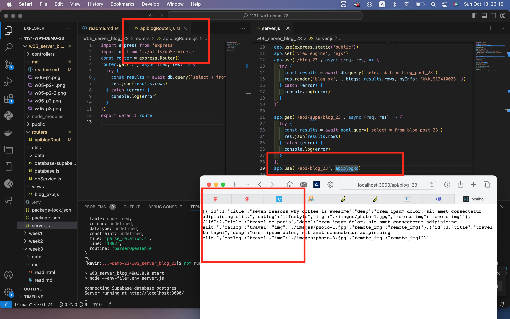

#### W05-P1: Use .env to connect Supabase, and show blogs via route /api/blog_xx


```

```


```

```

#### W05-P2: Use blog theme to create blog_xx.ejs and show your info from pinfo variable


```

```

### Video: W05-P3: Add js code into blog_xx.ejs and show blogs obtained from Supabase blog_xx table


```

```

###  W05-P3: Add js code into blog_xx.ejs and show blogs obtained from Supabase blog_xx table


```

```

### : W05-P4: Refactor P3 code using router concept in MVC architecture
 

 
```

```

### git log

```

2c66b27 Mario Catuogno  Sun Oct 13 23:23:57 2024 +0800  add pdfs
582401e Mario Catuogno  Sun Oct 13 23:23:09 2024 +0800  W05-P4: Refactor P3 code using router concept in MVC architecture
d6d9ee3 Mario Catuogno  Sun Oct 13 23:15:33 2024 +0800  W05-P1: Use .env to connect Supabase, and show blogs via route /api/blog_xx
```