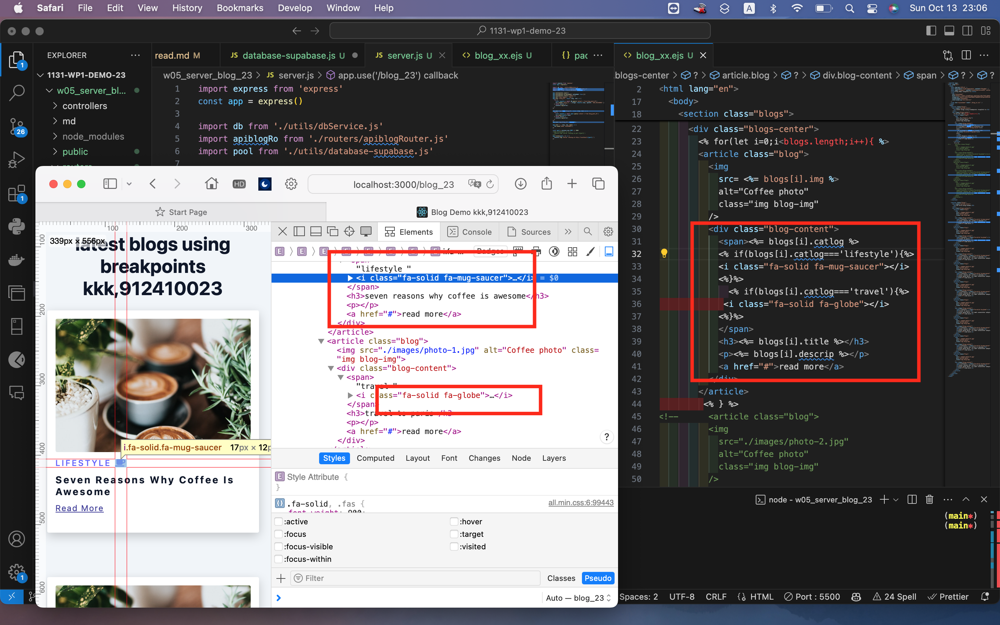

#### W05-P1: Use .env to connect Supabase, and show blogs via route /api/blog_xx


```

```


```

```

#### W05-P2: Use blog theme to create blog_xx.ejs and show your info from pinfo variable


```

```

### Video: W05-P3: Add js code into blog_xx.ejs and show blogs obtained from Supabase blog_xx table



```

```

Video: W05-P3: Add js code into blog_xx.ejs and show blogs obtained from Supabase blog_xx table


```

```
