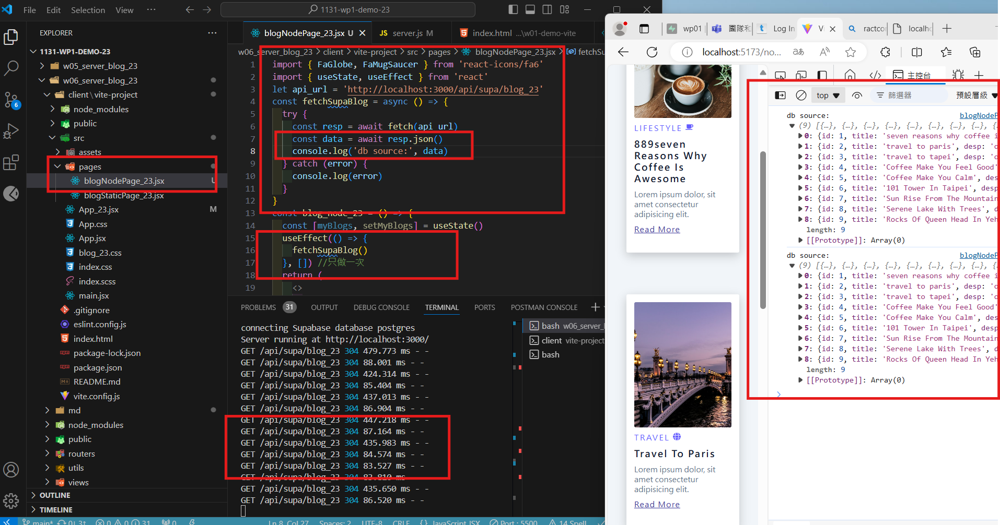

#### W06-P1: Insert 9 blogs into Supabase, and retrieve through route localhost:3000/api/blog_xx


```
commit 619084ac096573775f33b0e53bac9479a27a64aa (HEAD -> main)
Author: Yu <912410023>
Date:   Wed Oct 16 18:38:52 2024 +0800

    W06-P1: Insert 9 blogs into Supabase, and retrieve through route localhost:3000/api/blog_xx
```

#### Video: W06-P2: Create a vite, and show 4 static blogs from blog.html


```
Author: Yu <912410023>
Date:   Wed Oct 16 19:23:44 2024 +0800

    W06-P2: Create a vite, and show 4 static blogs from blog.html
```

#### W06-P3: Create BlogStaticPage_xx component to show 4 static photos with corresponding react-icons


```
W06-P3: Create BlogStaticPage_xx component to show 4 static photos with corresponding react-icons
```

W06-P4: Get the blogs from node server, view not yet rendered

#### => use console to check if blogs are retrieved from the node server



#### => use React DevTools to view blogs


#### => server setup cors and morgan


```
Author: Yu <912410023>
Date:   Wed Oct 16 21:01:51 2024 +0800

    W06-P4: Get the blogs from node server, view not yet rendered

```

### git log


```
ad377aa5998bb39c84f4d838b2ce6d282dffc268 (HEAD -> main, origin/main, origin/HEAD) W06-P4: Get the blogs from node server, view not yet rendered
deeca6e468b032a5f0688685ff9f7f9834b18c3d W06-P3: Create BlogStaticPage_xx component to show 4 static photos with corresponding react-icons
5dbd715684934ecee0ef2710872770e0f6fb0b0e W06-P2: Create a vite, and show 4 static blogs from blog.html
619084ac096573775f33b0e53bac9479a27a64aa W06-P1: Insert 9 blogs into Supabase, and retrieve through route localhost:3000/api/blog_xx
```
