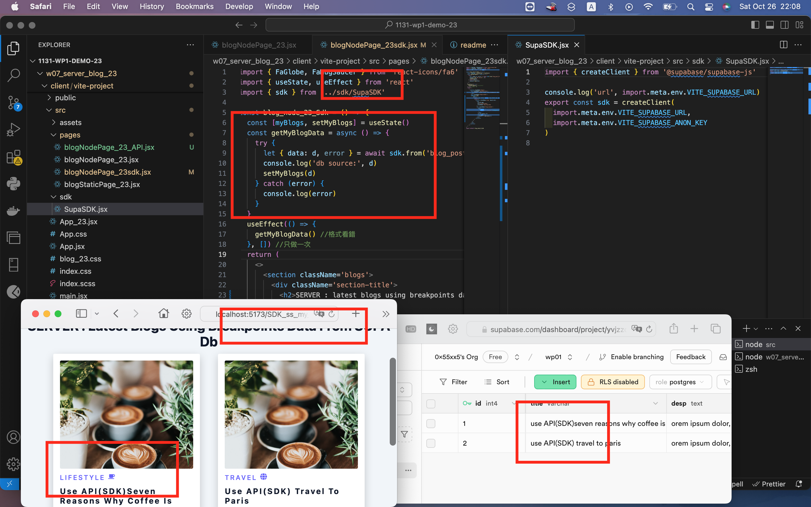
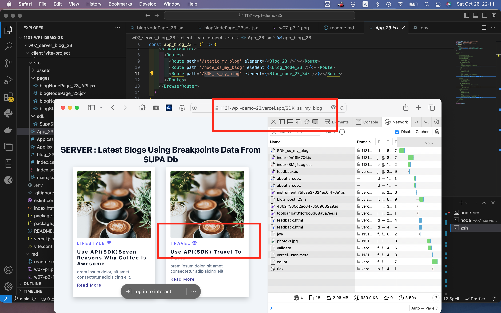

### vercel: https://1131-wp1-demo-23.vercel.app/static_my_blog

#### W07-P1: Get 9 blogs from Node server and show them correctly


```

d9d23be Mario Catuogno  Sat Oct 26 21:35:09 2024 +0800  deploy vercel
b442d5a Mario Catuogno  Sat Oct 26 19:56:07 2024 +0800  add pdf
```

### W07-P2: Deploy Github repo 1131_2N_classdemo_xx to Vercel

#### => Chrome using /static_xx route


#### => Github repo with associated Vercel link


#### => Vercel Project with setttings (environment variable)


```
0544d12 Mario Catuogno  Sat Oct 26 21:51:50 2024 +0800  w7p1p2
```

### W07-P3: Create BlogSupaPage_xx to access blogs from Supabase

#### => from local



#### => from Vercel



```

68468a4 Mario Catuogno  Sat Oct 26 22:10:10 2024 +0800  W07-P3: Create BlogSupaPage_xx to access blogs from Supabase
```

### W07-P4: Create Blog-xx component for each blog, and show correctly


```
e49120a   Sat Oct 26 22:47:01 2024 +0800  W07-P4: Create Blog-xx component for each blog, and show correctly

```
