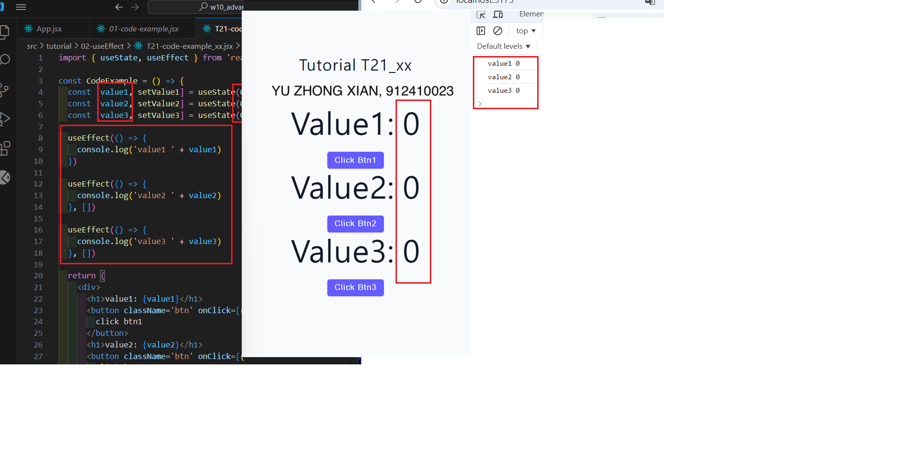

### W10-P1: Show how count data sync with UI
 
##### => data not sync with UI
 

 
##### => data sync with UI
 

 
```
244asdt0 912410023 Nov 13 19:33:49 2024 +0800  W10-P1: Show how count data sync with UI


```

### W10-P2: store value1, value2, value3 using useState, and show results by clicking btns
 
#### => first time
 

 
#### => click Btn1, click Btn2, click Btn3 one by one
 

 
```
843ee3u 912410023 Wed Nov 13 19:55:15 2024 +0800  W10-P2: store value1, value2, value3 using useState, and show results by clicking btns
```
W10-P3: Implement P4Page_xx.jsx that has menu filter function
 
#### => press btns starting from all, breakfast, lunch, dessert, shakes, and check console results
 

 
```
102t434 912410023 Wed Nov 13 21:12:23 2024 +0800  W10-P3: Implement P4Page_xx.jsx that has menu filter function
```
 
### W10-P4: all git logs of W10
 


```


acc9e09  Wed Nov 20 16:40:18 2024 +0800  w10-P3P4
93f0263   Wed Nov 20 16:16:42 2024 +0800  W10-P2: store value1, value2, value3 using useState, and show results by clicking btns
d90e50e   Wed Nov 20 15:32:40 2024 +0800  W10-P1: Show how count data sync with UI

```