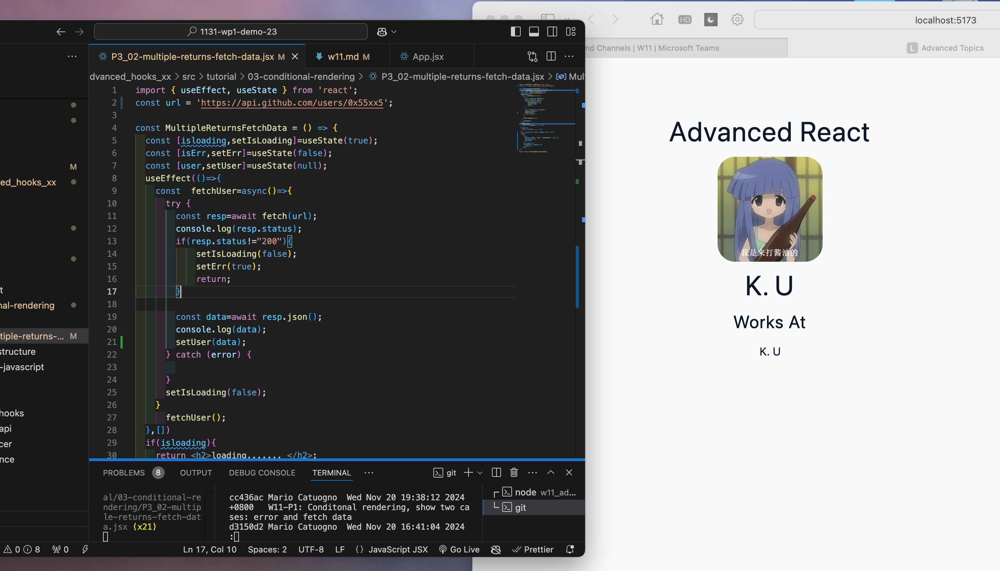
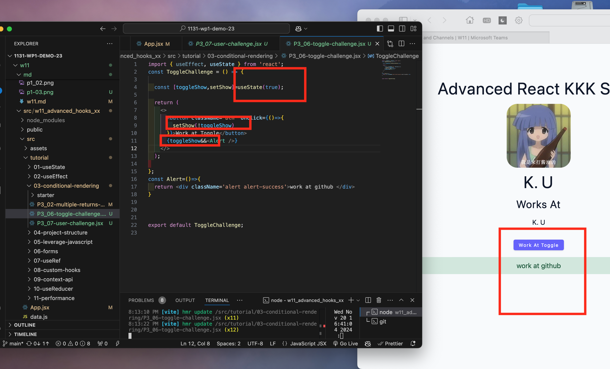
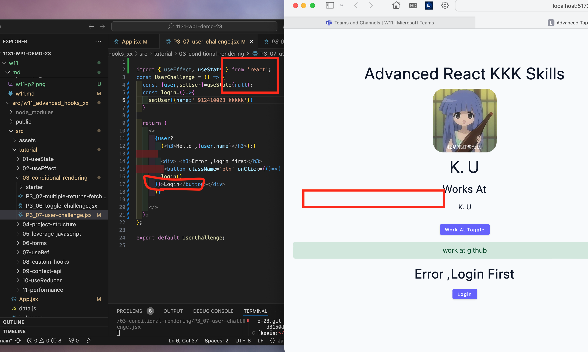
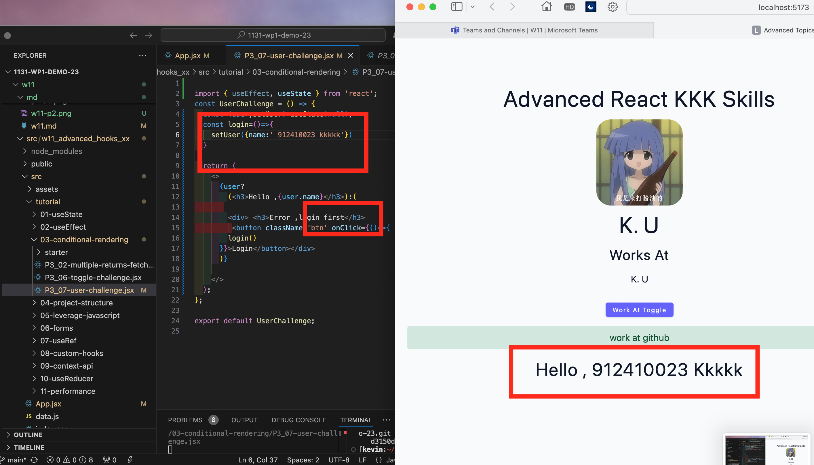
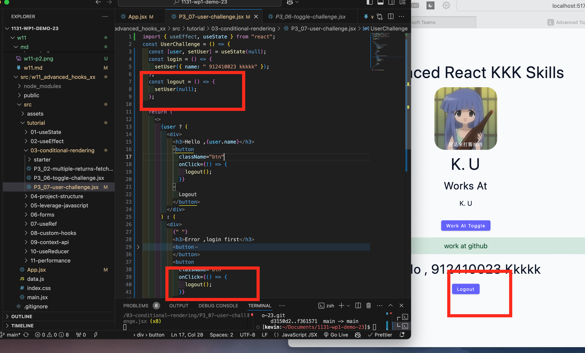

### W11-P1: Conditonal rendering, show two cases: error and fetch data
 
##### => show "error" message
 

 
##### => show "fetch data" message
 



 
```

cc436a 912410023  Wed Nov 20 19:38:12 2024 +0800   W11-P1: Conditonal rendering, show two cases: error and fetch data
```


### W11-P2: toggle Alert
 

 
```
887b525 912410023 Wed Nov 20 20:12:45 2024 +0800  W11-P2: toggle Alert
```

### W11-P3: login logout
 

 #### initial logout

#### press btn to  logout


#### press btn to logout

 
```
e440b6a 912410023 Wed Nov 20 20:39:00 2024 +0800    W11-P3: login logout
```


### git logs

```
ae3b6a3 kkkk    Wed Nov 20 20:45:25 2024 +0800  add pdf
e440b6a kkk  Wed Nov 20 20:39:00 2024 +0800    W11-P3: login logout
f361571 kkk  Wed Nov 20 20:15:15 2024 +0800    W11-P2: toggle Alert
22bd1c2 kkk  Wed Nov 20 20:14:47 2024 +0800    W11-P2: toggle Alert
cc436ac kkk  Wed Nov 20 19:38:12 2024 +0800    W11-P1: Conditonal rendering, show two cases: error and fetch data
```