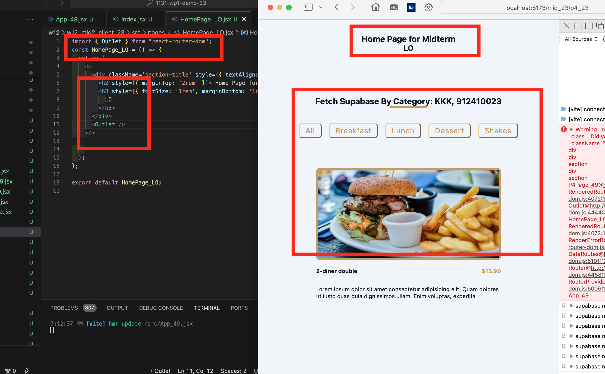
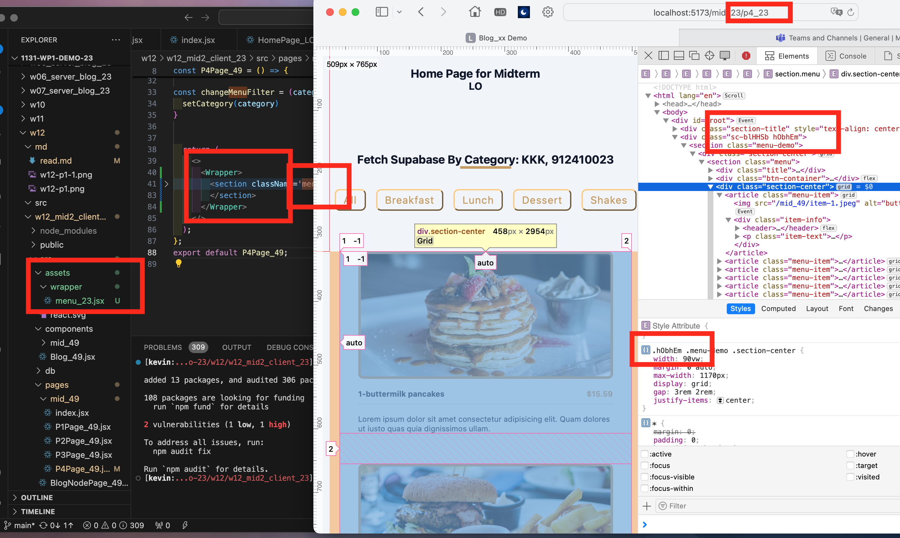
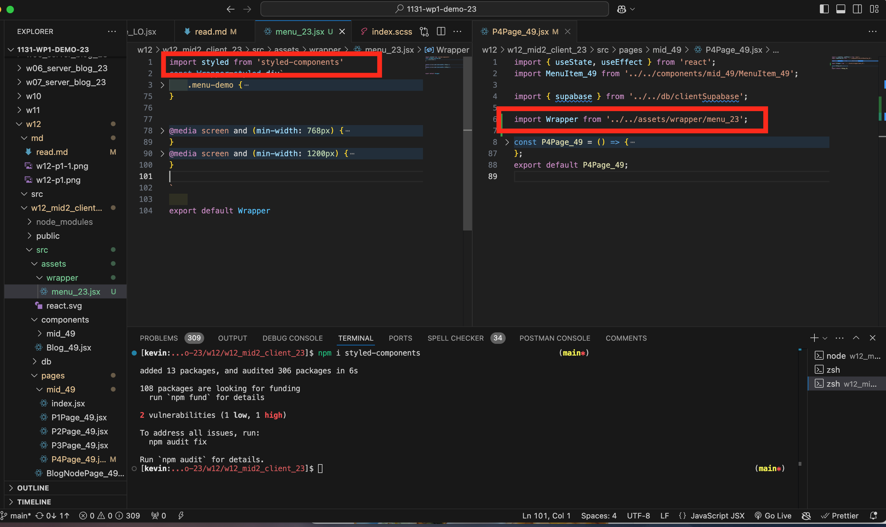
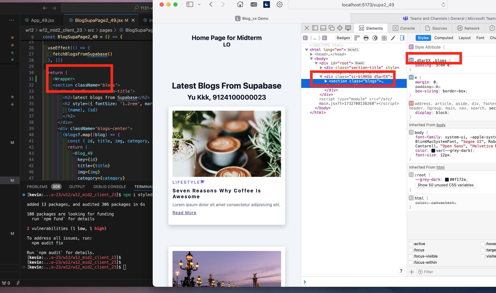
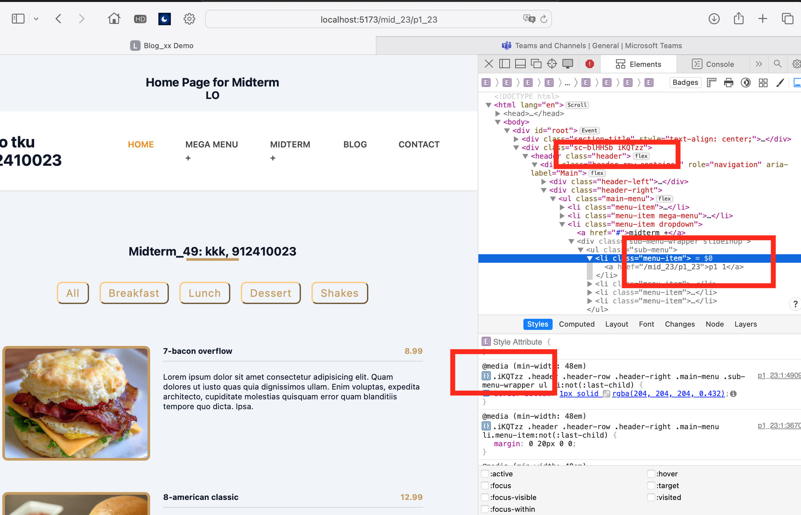
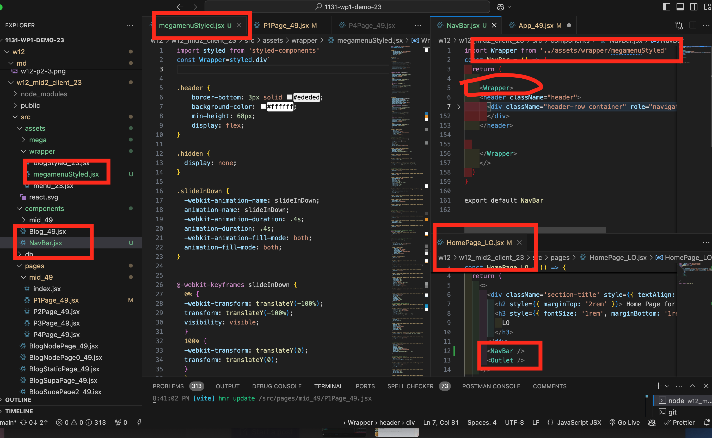

### W12-P1: use createBrowserRouter and RouterProvider to build routes
 



 
```
b4fd909 kkkk    Wed Nov 27 19:18:47 2024 +0800  W12-P1: use createBrowserRouter and RouterProvider to build routes
```


### W12-P2: Use styled component for Menu and Blog scss, and make it work correctly
 
#### => Show Menu with route /mid_xx/p4_xx
 

 
#### => Show the code using Menu styled component
 

 
#### => Show Blog with route /supa2_xx
 

 
```
5430f90 kkkk    Wed Nov 27 20:01:48 2024 +0800  W12-P2: Use styled component for Menu and Blog scss, and make it work correctly
```


### W12-P3: Use mega menu theme (html, css) and make it a navbar using styled components
 
#### => Chrome demo with code
 

 
#### => source code for HomeLayout_xx.jsx, Navbar_xx (component and css)
 

 
```

97619b8 kkkk    Wed Nov 27 20:53:29 2024 +0800  W12-P3: Use mega menu theme (html, css) and make it a navbar using styled components
5430f90 kkkk    Wed Nov 27 20:01:48 2024 +0800  W12-P2: Use styled component for Menu and Blog scss, and make it work correctly
b4fd909 kkkk    Wed Nov 27 19:18:47 2024 +0800  W12-P1: use createBrowserRouter and RouterProvider to build routes
```

#### git log

```

97619b8 kkkk    Wed Nov 27 20:53:29 2024 +0800  W12-P3: Use mega menu theme (html, css) and make it a navbar using styled components
5430f90 kkkk    Wed Nov 27 20:01:48 2024 +0800  W12-P2: Use styled component for Menu and Blog scss, and make it work correctly
b4fd909 kkkk    Wed Nov 27 19:18:47 2024 +0800  W12-P1: use createBrowserRouter and RouterProvider to build routes
```