#### W13-P1: Show initially the form
 
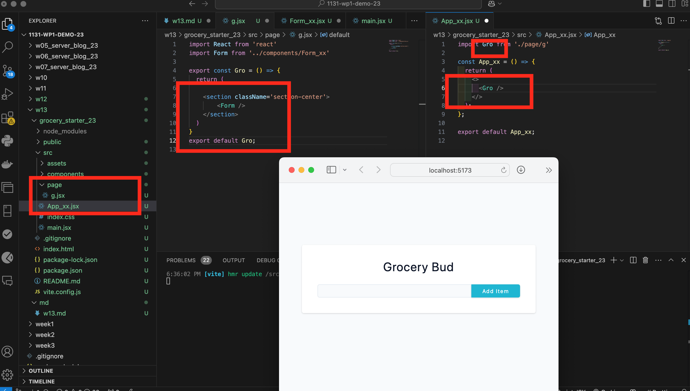
 
```

```

### W13-P2: Implement addItem, and display all items
 
#### => Form_xx.jsx, Grocery_xx.jsx code
 
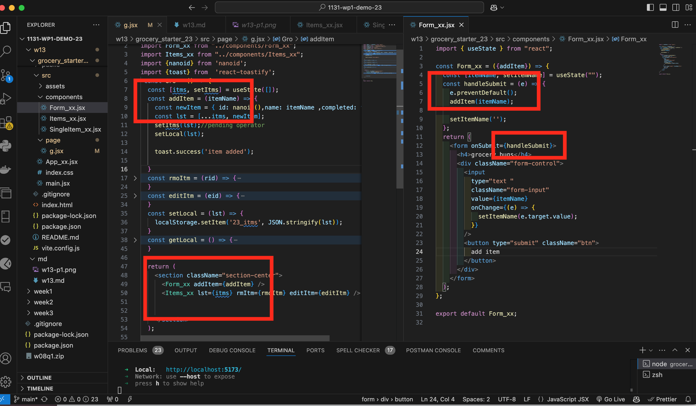
 
#### => Items_xx.jsx, SingelItem_xx.jsx code
 
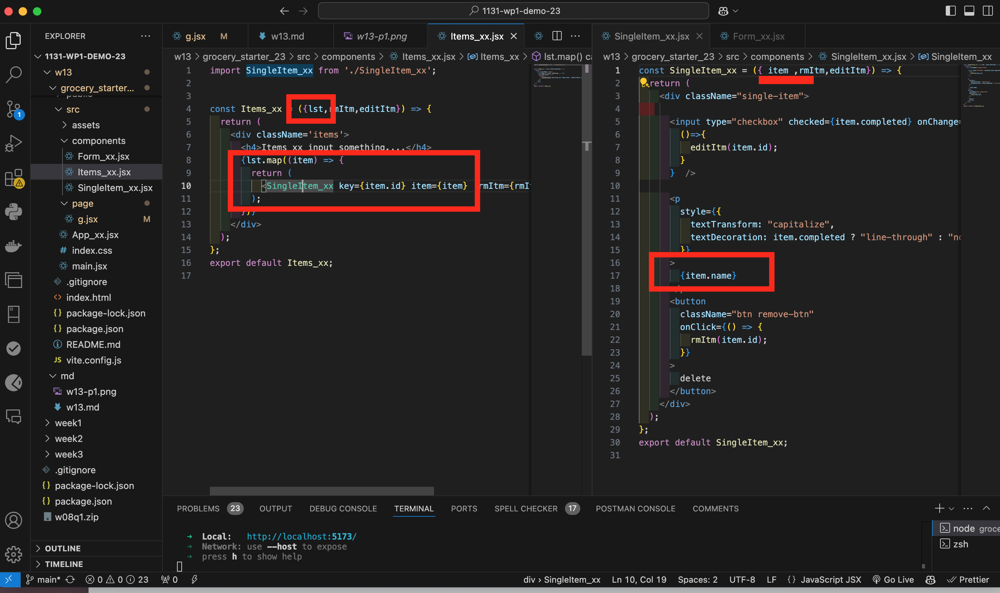

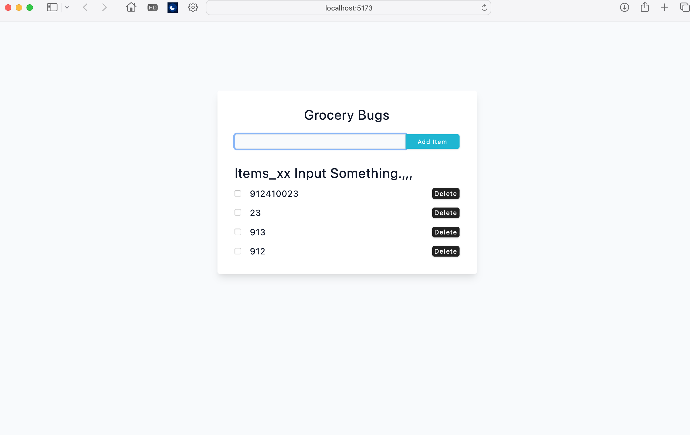
 
```

```


### W13-P3: Add react-toastify for alert, implement delete item
 
#### => Show how to make react-toastify work
 
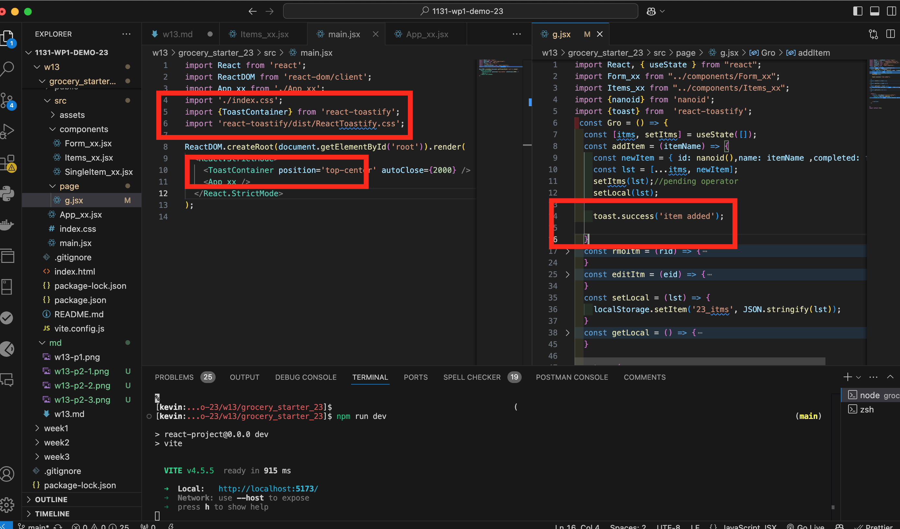
 
#### => Add three items, and remove the second one
 
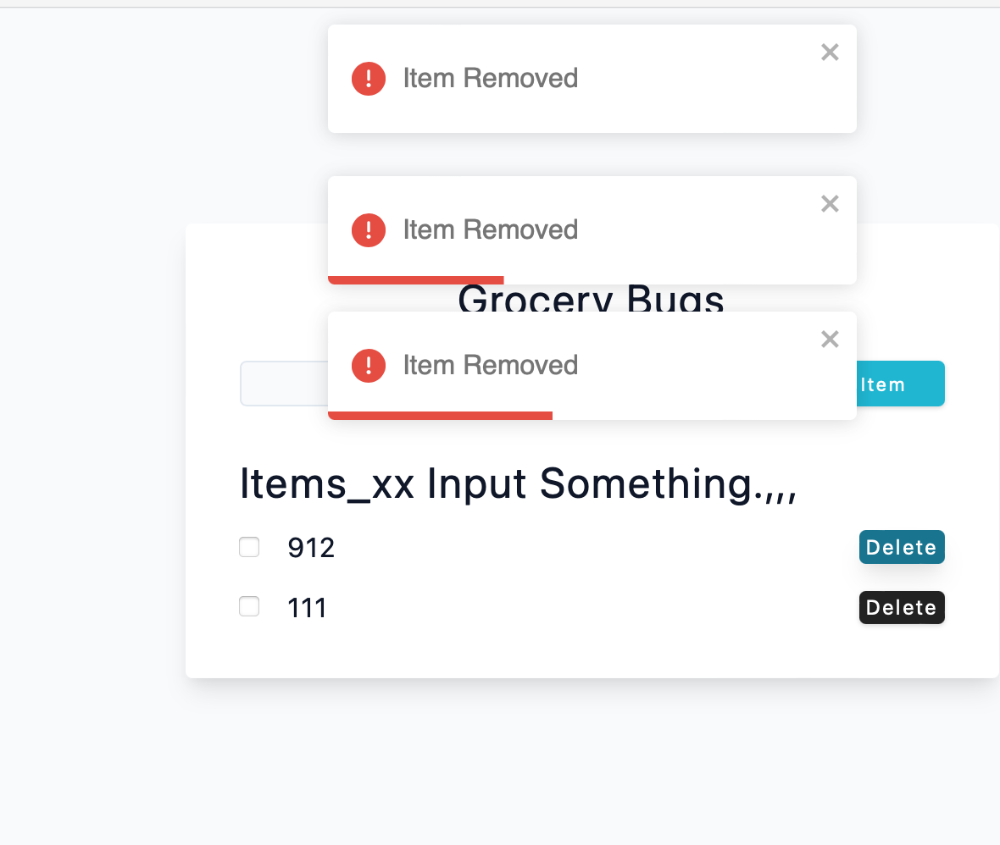
 
#### => Show how removeItem() being transferred from GroceryPage_xx -> Items_xx -> SingleItem_xx
 
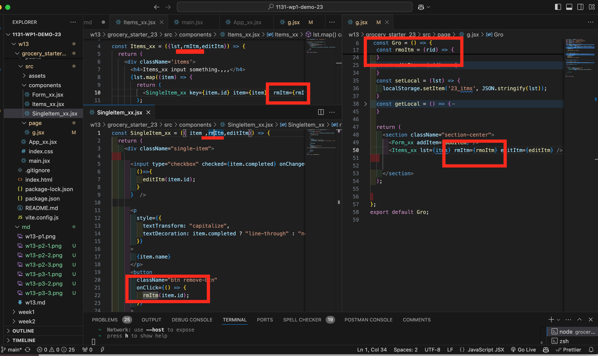
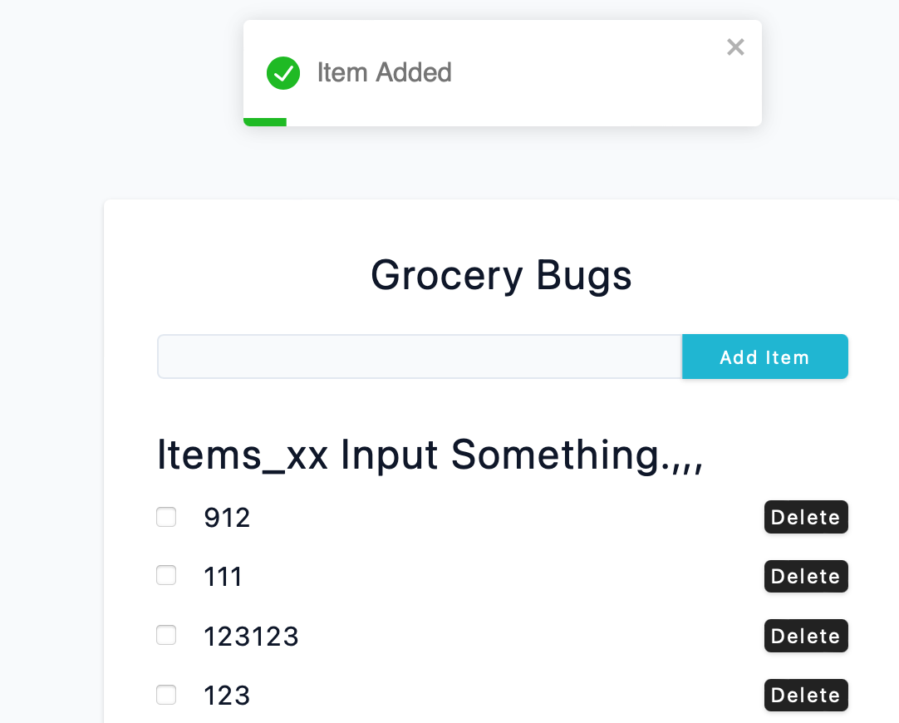
 
```

```


### W13-P4: Implement editItem
 
#### => => Add three items, and edit the third item by pressing checkbox
 
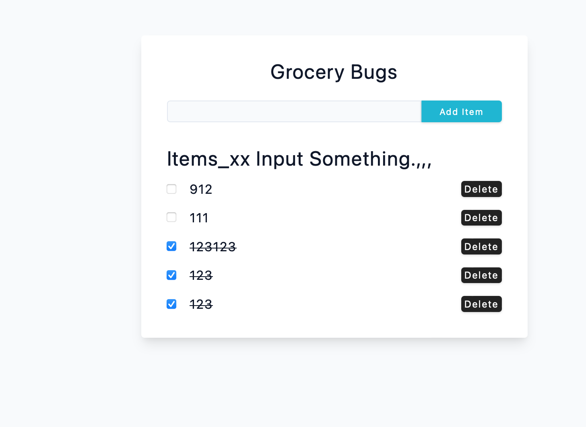
 
#### => Show how editItem() being transferred from GroceryPage_xx -> Items_xx -> SingleItem_xx
 
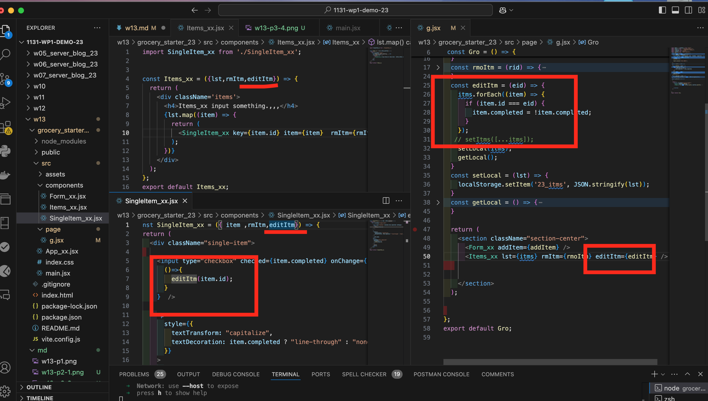
 
```

```


### W13-P5: Use localStorage to get and set items data
 
#### => demo setLocalStorage by addItem
 
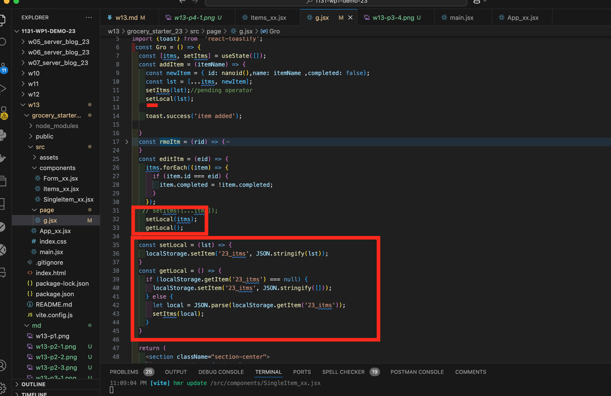
 
#### => demo localStorage by editItem, removeItem
 

 
#### => get localStorage when refreshing the browser
 
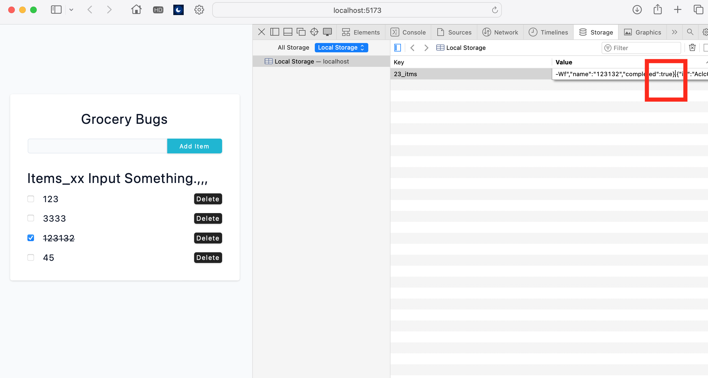
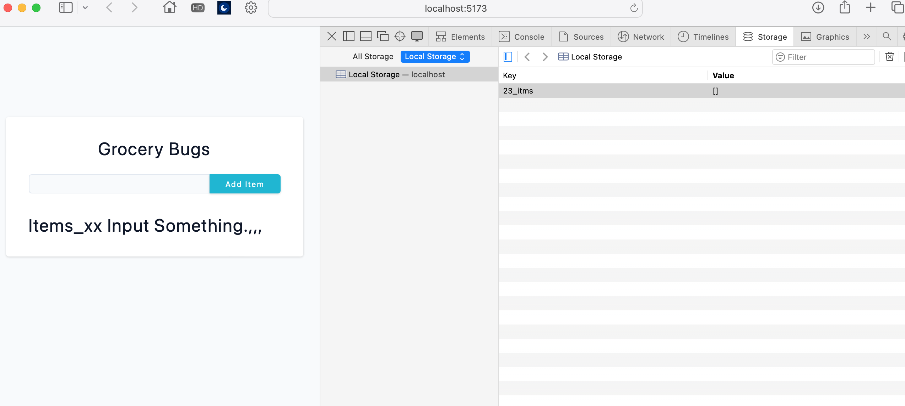
 
```

```
 
### W13-P6: git logs of W13
 
