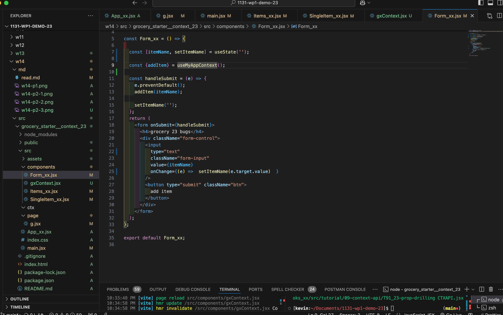

### W14-P1: create a custom hook useToggle to toggle a button
 

 
```

```


### W14-P2: Convert drop drilling code into context api code
 


 
```

```


### W14-P3: Convert w13 code into context api code
 
#### => show from Chrome components and SingleItem_xx.jsx
 

 
#### => Show code (main.jsx, App_xx.jsx, Form_xx.jsx)
 

 
#### => Show code (Items_xx.jsx, SingleItems_xx.jsx)
 


 
```

```