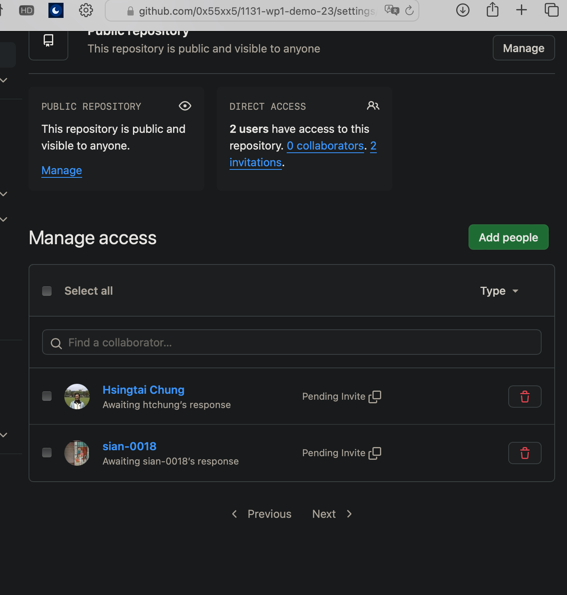
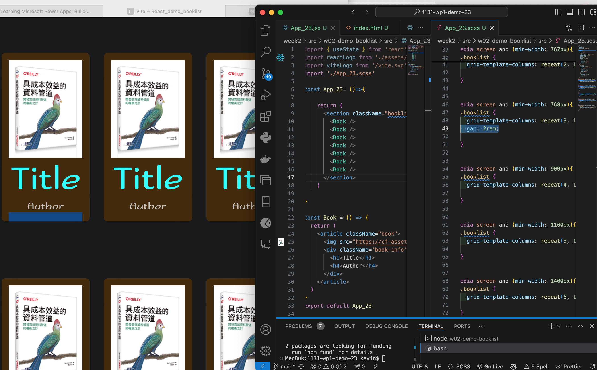
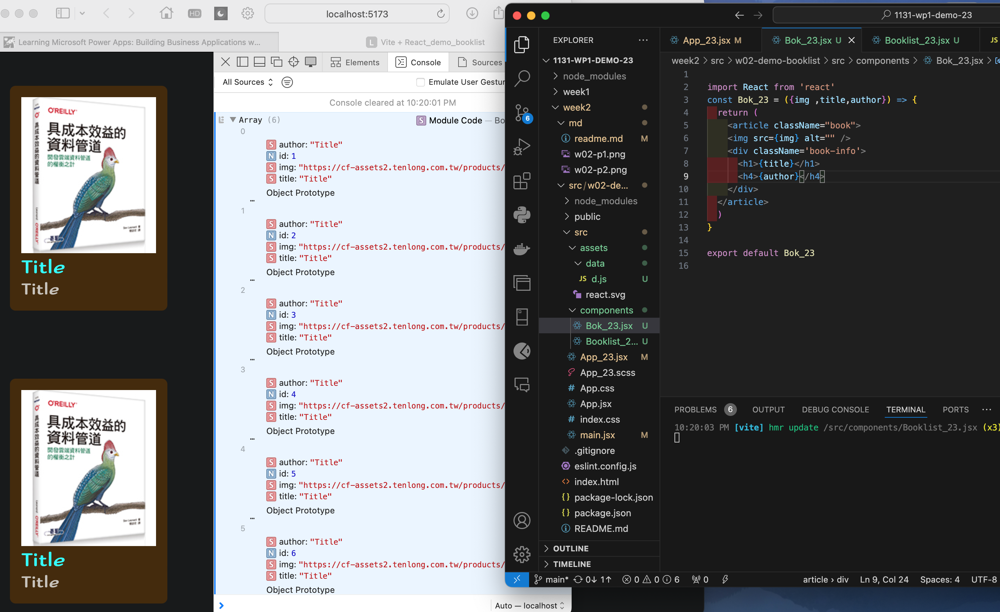

[github](https://github.com/0x55xx5/1131-wp1-demo-23)




### W02-P2: Show 6 Book component in React with responsive design
 

 
```
e6e8f64 Mario Catuogno  Sat Sep 21 22:32:45 2024 +0800  W02-P4: Get 6 different book data from Amazon, and show these 6 data correctly
eb378f0 Mario Catuogno  Sat Sep 21 21:17:23 2024 +0800  ### W02-P2: Show 6 Book component in React with responsive design
38c6ed4 Mario Catuogno  Sat Sep 21 20:07:05 2024 +0800  W01-P2: Give your name and ID in demo using create-react-app and vite
7379529 Mario Catuogno  Sat Sep 21 19:54:16 2024 +0800  W01-P1: node_modules size comparison: create-react-app vs. vite
```


Video: W02-P3: Create books_data (6 similar data) as json array and put it into <Booklist_xx />, then create 6 <Book_xx />
 


 
```
e6e8f64 Mario Catuogno  Sat Sep 21 22:32:45 2024 +0800  W02-P4: Get 6 different book data from Amazon, and show these 6 data correctly
eb378f0 Mario Catuogno  Sat Sep 21 21:17:23 2024 +0800  ### W02-P2: Show 6 Book component in React with responsive design
38c6ed4 Mario Catuogno  Sat Sep 21 20:07:05 2024 +0800  W01-P2: Give your name and ID in demo using create-react-app and vite
7379529 Mario Catuogno  Sat Sep 21 19:54:16 2024 +0800  W01-P1: node_modules size comparison: create-react-app vs. vite
```

### W02-P4: Get 6 different book data from Amazon, and show these 6 data correctly
 


 
```

e6e8f64 Mario Catuogno  Sat Sep 21 22:32:45 2024 +0800  W02-P4: Get 6 different book data from Amazon, and show these 6 data correctly
eb378f0 Mario Catuogno  Sat Sep 21 21:17:23 2024 +0800  ### W02-P2: Show 6 Book component in React with responsive design
38c6ed4 Mario Catuogno  Sat Sep 21 20:07:05 2024 +0800  W01-P2: Give your name and ID in demo using create-react-app and vite
7379529 Mario Catuogno  Sat Sep 21 19:54:16 2024 +0800  W01-P1: node_modules size comparison: create-react-app vs. vite
```
 