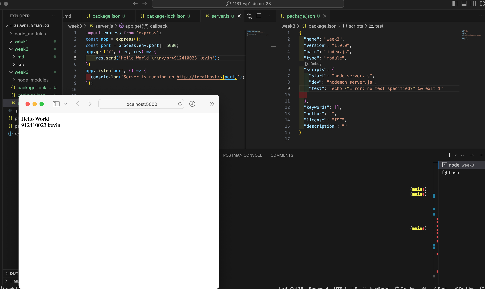
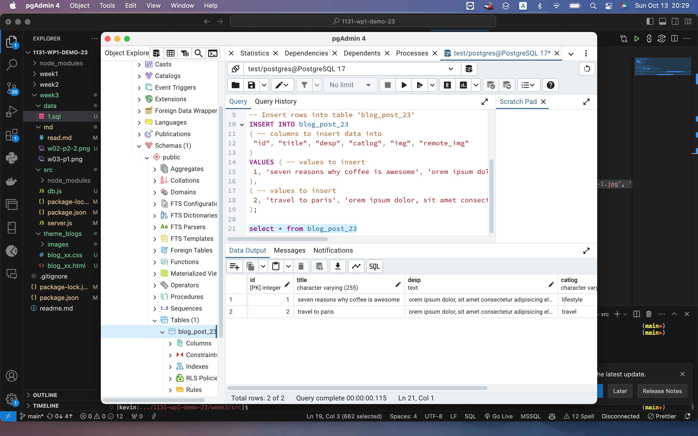
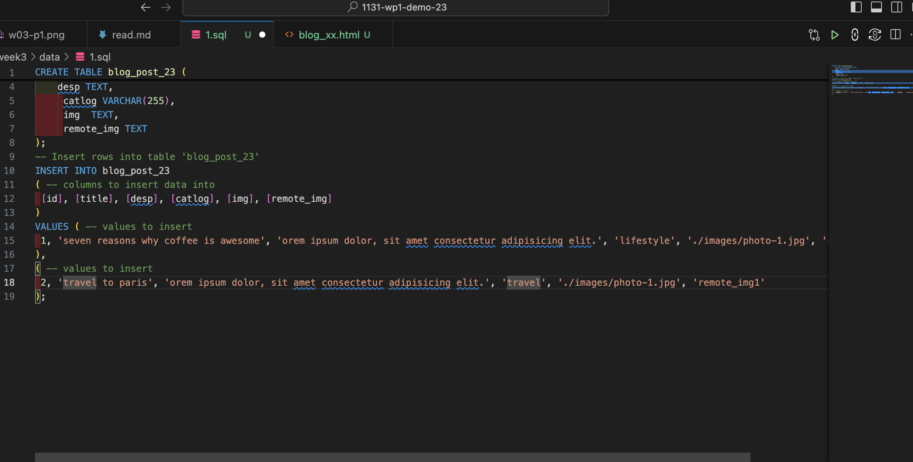
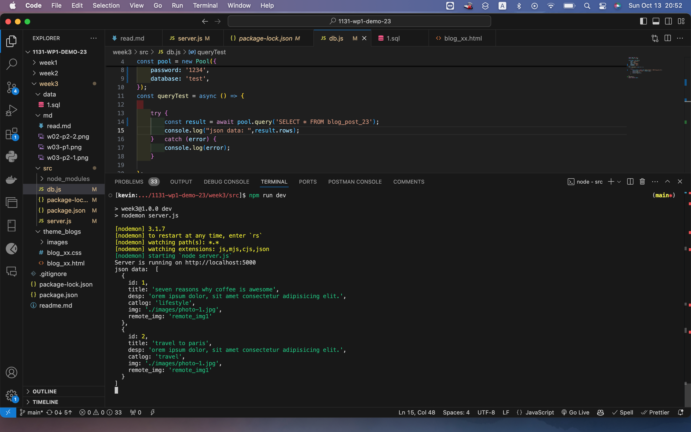
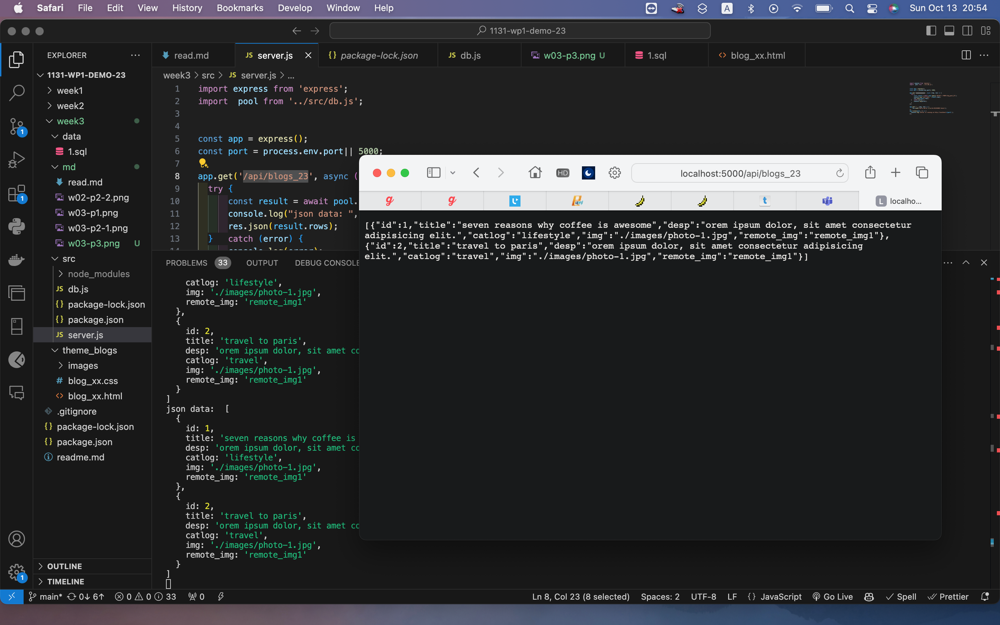
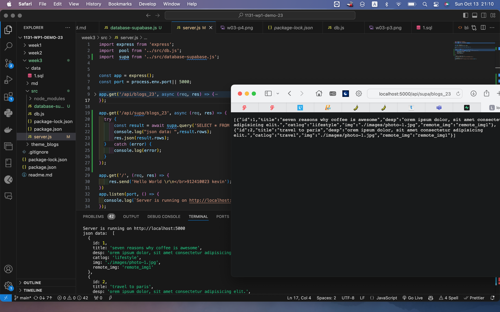

[github](https://github.com/0x55xx5/1131-wp1-demo-23)


#### W03-P1: Create an express Web server and show your name and ID
 

 
```

```

#### Create wp1_demo_xx database with a table blog_xx, and put 2 data into blog_xx
 
##### => pgAdmin
 

 
##### => sql
 

 
```

```


#### W03-P3: Create database.js to connect blog_xx as in P2 and show 2 data
 

 
```
```


#### W03-P4: Using route /api/blog_xx to get json data and show it in the browser
 

 
```
```


#### W03-P5: Using route /api/blog_xx to get json data from Supabase, and show it in the browser
 

 
```
```